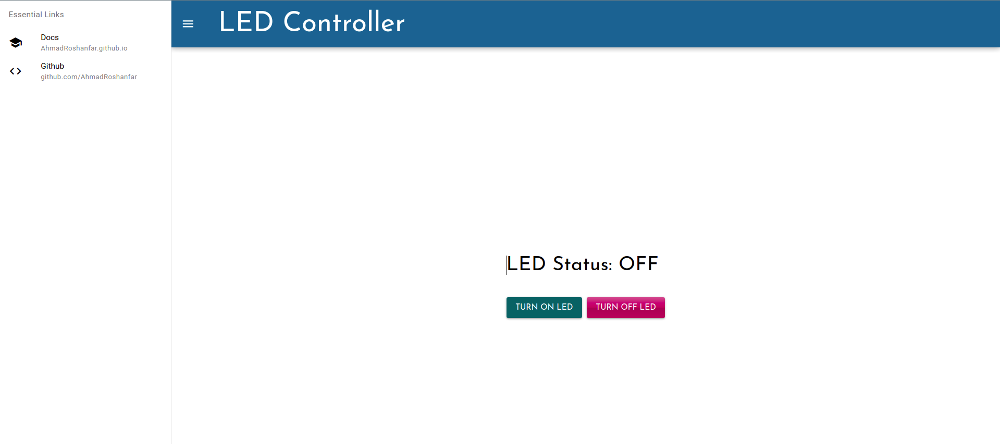

# LED Controller with ESP32 HTTP Webserver with Vue3 + Quasar

## live demo of website
```
$ cd front/led-quasar
$ quasar dev  
```

## Website Compilation
```
$ quasar build 
```

## Wifi Configuration
```
$ idf.py menuconfig 
Exmaple Connection -> Enter SSID and Password of your wifi 
```
## Build and Flash
```
$ idf.py build flash monitor
```

